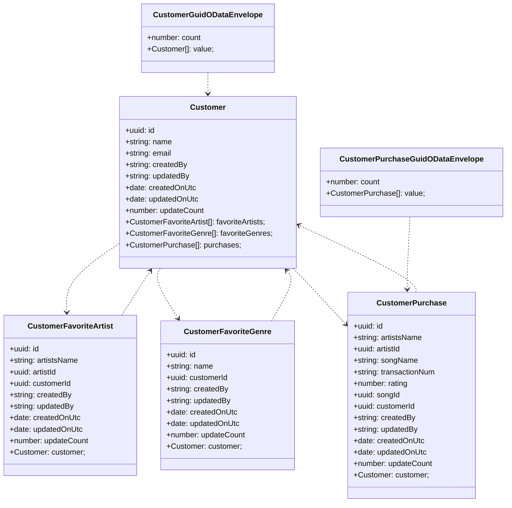

```mermaid
classDiagram

  Customer ..> CustomerFavoriteArtist
  Customer ..> CustomerFavoriteGenre
  Customer ..> CustomerPurchase
  CustomerFavoriteArtist ..> Customer
  CustomerFavoriteGenre ..> Customer
  CustomerGuidODataEnvelope ..> Customer
  CustomerPurchase ..> Customer
  CustomerPurchaseGuidODataEnvelope ..> CustomerPurchase

  class Customer{
    +uuid: id
    +string: name
    +string: email
    +string: createdBy
    +string: updatedBy
    +date: createdOnUtc
    +date: updatedOnUtc
    +number: updateCount
    +CustomerFavoriteArtist[]: favoriteArtists;
    +CustomerFavoriteGenre[]: favoriteGenres;
    +CustomerPurchase[]: purchases;
  }
  class CustomerFavoriteArtist{
    +uuid: id
    +string: artistsName
    +uuid: artistId
    +uuid: customerId
    +string: createdBy
    +string: updatedBy
    +date: createdOnUtc
    +date: updatedOnUtc
    +number: updateCount
    +Customer: customer;
  }
  class CustomerFavoriteGenre{
    +uuid: id
    +string: name
    +uuid: customerId
    +string: createdBy
    +string: updatedBy
    +date: createdOnUtc
    +date: updatedOnUtc
    +number: updateCount
    +Customer: customer;
  }
  class CustomerGuidODataEnvelope{
    +number: count
    +Customer[]: value;
  }
  class CustomerPurchase{
    +uuid: id
    +string: artistsName
    +uuid: artistId
    +string: songName
    +string: transactionNum
    +number: rating
    +uuid: songId
    +uuid: customerId
    +string: createdBy
    +string: updatedBy
    +date: createdOnUtc
    +date: updatedOnUtc
    +number: updateCount
    +Customer: customer;
  }
  class CustomerPurchaseGuidODataEnvelope{
    +number: count
    +CustomerPurchase[]: value;
  }
```
This file was generated by the [openapi-mermaid](https://www.npmjs.com/package/openapi-mermaid) tool.
